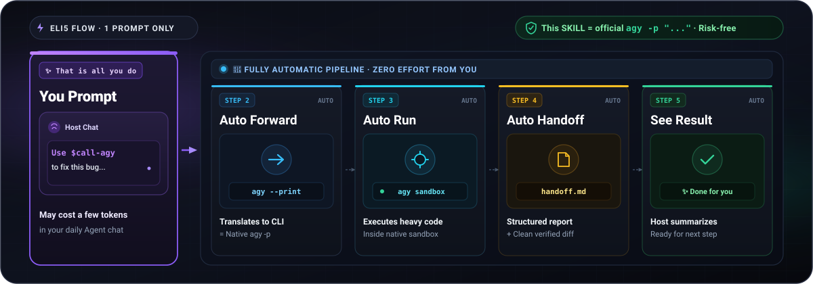

# call-agy

<p align="center">
  <strong>English</strong> | <a href="README.zh-CN.md">简体中文</a>
</p>

<p align="center">
  A host-agnostic Agent Skill for <strong>task-level delegation to the official Google Antigravity CLI (<code>agy</code>)</strong> in headless mode.
</p>

<p align="center">
  
</p>

<p align="center">
  <a href="https://github.com/F1rstDan/call-agy/releases"></a>
  <a href="https://github.com/F1rstDan/call-agy/blob/main/LICENSE"></a>
  <a href="https://github.com/F1rstDan/call-agy/commits/main"></a>
</p>

---

## Key Highlights

- Dispatch `agy` as a specialized sub-agent directly from your daily AI coding environment (e.g., Codex, DeepSeek Harness) without switching workflows or tools. (Gemini 3.7 Flash, Gemini 3.1 Pro, Claude Opus 4.6)
- **Zero API Keys & Zero Setup Hassle**: Get started instantly. Simply authenticate once via the official `agy` terminal CLI; no API keys, tokens, or secrets to configure or manage.
- **Outsource Complex Tasks with Structured Handoffs**: Delegate demanding code exploration, bug investigations, or test writing to Antigravity and receive clean Markdown handoff reports and verified git diffs.
- **Transparent & Secure Sub-Agent Boundary**: Built strictly on the official headless CLI interface. Never extracts OAuth credentials, never exposes external proxy ports, and respects explicit security boundaries.

<p align="center">
  
</p>

*One prompt delegates demanding tasks to the official headless `agy` CLI inside its native sandbox, returning structured Markdown handoffs back to your chat.*

---

## Quick Start

### 1. Prerequisites (3 Simple Steps)

1. **Install Antigravity CLI**: Ensure the official `agy` command-line tool is installed.
2. **Authenticate (One-time)**: Run `agy` once in your terminal to complete interactive login (no API keys needed).
3. **Install this Skill**:
   ```bash
   npx skills add F1rstDan/call-agy
   ```

### 2. Use Directly in Your Host Agent

Once installed, simply prompt your host Agent with natural language to delegate tasks.

**You can say:**

> **Scenario 1: Deep Architecture & Flow Analysis**
> ```text
> Use $call-agy to analyze the core request lifecycle in this repository and summarize key architectural findings.
> ```
> *Sub-agent analyzes the codebase in read-only mode and returns a structured analysis report.*

> **Scenario 2: Root-Cause Debugging & Verified Fixes**
> ```text
> Use $call-agy to investigate and fix this error. Pass tests/test_api.py and relevant source files as priority paths, then run tests to verify the fix.
> ```
> *Antigravity independently inspects the failure, applies the fix, runs tests, and delivers a handoff with git diffs.*

> **Scenario 3: Code Review & Optimization**
> ```text
> Have Antigravity review this module for concurrency safety and edge conditions, providing concrete optimization recommendations.
> ```
> *Leverages frontier reasoning capabilities for thorough, high-effort code reviews.*

> **Scenario 4: Multi-Turn Test Generation**
> ```text
> Based on the previous analysis, use $call-agy to write unit tests covering all boundary edge cases.
> ```
> *Seamlessly continues the session context across multiple turns without losing state.*

---

## Installation & Setup

### Option 1: `npx skills` (Recommended)

```bash
npx skills add F1rstDan/call-agy
```

Update:
```bash
npx skills update call-agy
```

### Option 2: `git clone`

<details>
<summary>Click to expand Git installation</summary>

```bash
# macOS / Linux
git clone https://github.com/F1rstDan/call-agy.git ~/.agents/skills/call-agy

# Windows (PowerShell)
git clone https://github.com/F1rstDan/call-agy.git "$env:USERPROFILE\.agents\skills\call-agy"
```

Update:
```bash
git -C ~/.agents/skills/call-agy pull
```

</details>

---

## Requirements

- **Antigravity CLI**: Official `agy` binary (v1.1.15+, latest recommended)
- **Authentication**: Logged in via interactive terminal `agy` once (no API keys)
- **Python**: Python 3.10+
- **Host Agent**: Any AI Agent supporting skills (Codex, DeepSeek Harness, etc.)

---

## Technical Reference & Internals

<p align="center">
  
</p>

For internal execution mechanics, CLI flags, security models, or troubleshooting, see:

👉 **[How It Works & Technical Reference (how_work.md)](how_work.md)**

---

## License & Notice

Licensed under the MIT License. See [LICENSE](LICENSE) and [NOTICE](NOTICE) for details.
