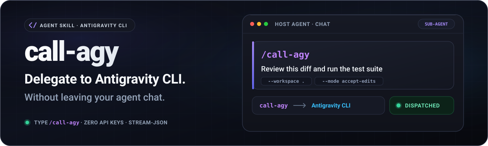
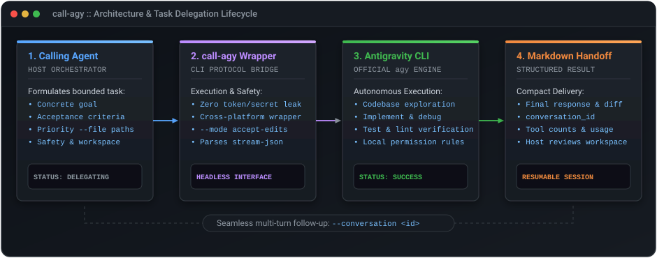

# call-agy

<p align="center">
  <strong>English</strong> | <a href="README.zh-CN.md">简体中文</a>
</p>

<p align="center">
  A host-agnostic Agent Skill for <strong>task-level delegation to the official Google Antigravity CLI (<code>agy</code>)</strong> in headless mode.
</p>

<p align="center">
  
</p>

<p align="center">
  <a href="https://github.com/F1rstDan/call-agy/releases"></a>
  <a href="https://github.com/F1rstDan/call-agy/blob/main/LICENSE"></a>
  <a href="https://github.com/F1rstDan/call-agy/commits/main"></a>
</p>

---

## Key Highlights

- **Explore New Models in Your Host Agent**: Call Antigravity directly from the AI coding environments you already use (e.g., Codex and DeepSeek Harness). Treat `agy` as a specialized sub-agent to test-drive, benchmark, and evaluate new models without switching tools or context.
- **Zero API Keys & Zero-Cost Onboarding**: Get started immediately. As long as you have completed a one-time interactive login via the official `agy` CLI, the Skill is ready to use—no API keys, tokens, or secrets need to be configured or shared.
- **Documented Sub-Agent Boundary**: Designed around task-level delegation through the official headless CLI interface. It is **not** a model-provider shim, never extracts OAuth credentials, and never exposes unauthenticated proxy endpoints.
- **Structured Markdown Handoffs & Durable Receipts**: Streams and parses official `stream-json` events into a clean Markdown handoff. A staging receipt is written before `agy` starts and continuously records partial response text and diagnostics, so interruption does not collapse into a misleading empty-success message.
- **Direct Long-Prompt Input & Resumable Sessions**: Sends messages up to 60 KiB directly through `stdin`. Larger prompts are safely staged beside the conversation handoff. Captures deterministic `conversation_id`s for seamless multi-turn follow-ups without context drift.
- **Cross-Platform & Flexible Safety Postures**: Includes zero-dependency native launchers for POSIX (`call_agy.sh`), Windows PowerShell (`call_agy.ps1`), and universal Python (`call_agy.py`). Provides a success-first preset for trusted workspaces alongside an explicit safe-mode override.

---

## How It Works

`call-agy` implements an Agent-to-Agent collaboration lifecycle:

<p align="center">
  
</p>

1. **Host Orchestration**: The calling AI Agent formulates a bounded task, setting parameters such as model selection (`--model`), completion criteria, workspace boundaries, and optional priority files (`--file`).
2. **Protocol Bridge**: `call_agy.py` normalizes paths and invokes `agy --print= --input-format stream-json --output-format stream-json`, streaming the assembled prompt via standard input.
3. **Authorized Execution**: Antigravity executes inside the designated workspace. `--mode plan` expresses read-only intent; `--mode accept-edits` permits authorized edits. Headless command execution is governed separately by Antigravity permission rules or an explicit auto-approval flag.
4. **Structured Handoff**: `call-agy` captures the terminal state, filters noisy tool payloads, and saves a compact Markdown handoff report under the system temporary directory.
5. **Host Verification**: The calling Agent inspects the handoff report and verifies actual workspace diffs before presenting the final result or proceeding with follow-up turns.

---

## Requirements

- **Antigravity CLI**: Official `agy` binary (version **1.1.15+** required for structured `stream-json` I/O; latest version recommended).
- **Authentication**: Signed in once via interactive terminal session (`agy`). **No API keys required**.
- **State-directory access**: The host process must be able to read and write `~/.gemini/antigravity-cli`; nested host sandboxes cannot be overridden by `agy` mode or sandbox flags.
- **Python**: Python 3.10+ available on PATH (callable via `python`, `python3`, or `py`).
- **Host Agent**: Any AI Agent capable of loading `SKILL.md` and launching local subprocesses, such as Codex or DeepSeek Harness.

> Official Antigravity headless docs: https://antigravity.google/docs/cli/headless/

---

## Installation & Setup

### Option 1: `npx skills` (Recommended)

```bash
npx skills add F1rstDan/call-agy
```

Update:
```bash
npx skills update call-agy
```

### Option 2: `git clone`

```bash
# macOS / Linux
git clone https://github.com/F1rstDan/call-agy.git ~/.agents/skills/call-agy

# Windows (PowerShell)
git clone https://github.com/F1rstDan/call-agy.git "$env:USERPROFILE\.agents\skills\call-agy"
```

Update:
```bash
git -C ~/.agents/skills/call-agy pull
```

---

## Quick Start

### 1. Authenticate Antigravity (One-time, Zero Config)

```bash
agy
```

*Run `agy` once in your terminal to complete interactive login. No API keys needed.*

### 2. Run a Delegated Task

#### macOS / Linux (POSIX Shell)

```bash
sh ./scripts/call_agy.sh "Explain the main request flow in this repository" --workspace .
```

#### Windows (PowerShell)

```powershell
& ".\scripts\call_agy.ps1" --task "Explain the main request flow in this repository" --workspace .
```

*Call the launcher directly in the current PowerShell process. A nested `powershell -Command` adds unnecessary quoting layers.*

#### Universal (Python 3)

```bash
python3 scripts/call_agy.py "Explain the main request flow in this repository" --workspace .
```

#### Long-Prompt / Multiline Input (stdin)

For complex tasks or multiline specifications, pipe the prompt via `stdin`:

```powershell
@'
Inspect this repository.
Explain the core architecture and verify each finding directly against the source code.
'@ | .\scripts\call_agy.ps1 --workspace .
```

*Prompts up to 60 KiB stream directly through memory. Larger serialized prompts are staged in a private per-turn directory under `%TEMP%/call-agy/.big-prompt/`, exposed only for that turn, and relocated alongside the final handoff.*

### 3. Execution Output

Upon completion, `call-agy` outputs compact metadata to stdout:

```text
receipt_path=<system-temp>/call-agy/.staging/<turn-id>-receipt.md
conversation_id=<conversation-id>
output_path=<system-temp>/call-agy/<conversation-id>/<turn-id>-handoff.md
elapsed=14.2s
status=SUCCESS
```

`receipt_path` is emitted before `agy` launches and remains available if the host kills the wrapper before a final handoff is produced. The calling Agent reads `output_path` when present, otherwise the receipt, and verifies any repository changes. The `conversation_id` serves as the durable handle for multi-turn continuations.

---

## Resuming Conversations

To continue a previous Antigravity session with full historical context, supply the exact `conversation_id`:

```bash
sh ./scripts/call_agy.sh \
  "Now add comprehensive unit tests for the edge cases identified above" \
  --workspace . \
  --conversation "<conversation-id>"
```

> **Tip**: While `-c, --continue` resumes the most recent workspace session, `--conversation <id>` is strongly recommended for deterministic multi-turn workflows.

---

## Typical Agent Prompt Pattern

**You can say:**

When prompting your host Agent to delegate a task to Antigravity:

```text
Use $call-agy to investigate this bug in the current workspace with the latest model (--model <slug>).
Provide the failing test and relevant source files as priority paths (--file).
Let Antigravity implement and verify the fix as a sub-agent, then review its handoff and git diff before reporting back.
```

---

## Command-Line Options

| Option | Description |
| :--- | :--- |
| `-w, --workspace <path>` | **Wrapper only**: Set process working directory and grant native `agy` access (default: current directory). |
| `-f, --file <path>` | **Wrapper only**: Append priority path hints to the prompt (repeatable). |
| `--add-dir <path>` | Grant Antigravity access to an external directory outside the workspace (repeatable). |
| `--conversation <id>` | Resume a specific Antigravity conversation by ID. |
| `-c, --continue` | Resume the most recent conversation in the workspace. |
| `--model <slug>` | Explicit model override from `agy models` (defaults to CLI configuration). |
| `--effort <low\|medium\|high>` | Reasoning effort level. |
| `--agent <name>` | Select built-in or custom agent persona from `agy agents`. |
| `--timeout <duration>` | Execution timeout, e.g., `10m`, `30m` (default: `10m`). |
| `--wrapper-timeout <duration>` | Hard wrapper watchdog. Defaults to `--timeout` plus 30 seconds, must exceed `--timeout`, and should remain below the host timeout. |
| `--mode <accept-edits\|plan>` | Execution mode; use `accept-edits` for authorized file modifications. |
| `--sandbox` | Enforce Antigravity terminal sandbox restrictions. |
| `--dangerously-skip-permissions` | **Dangerous native `agy` flag**: Auto-approve all tool calls. Used by the trusted-workspace preset. |
| `-o, --output <path>` | Custom Markdown handoff report destination. |
| `--raw-output <path>` | Debugging: Capture raw NDJSON event stream. |
| `--force` | Allow explicit output paths to replace existing files; otherwise call-agy selects and reports a unique suffixed name. |
| `--agy-binary <path>` | Custom `agy` executable path or binary name. |
| `--dry-run` | Print assembled command shape, prompt size, and transport mode without executing. |

---

## Permissions, CLI Boundary & Safety Model

- **Documented Sub-Agent Delegation**: `call-agy` interacts with the official `agy` binary exclusively via documented headless mode. It is not a model proxy, does not extract OAuth tokens, and does not expose external network listeners.
- **Zero Credential Exposure**: The Skill never asks for, reads, or stores API keys or OAuth secrets. It relies entirely on the local user session managed by the official binary.
- **Four Independent Permission Layers**: Host filesystem policy, Antigravity terminal sandboxing, mode intent, and Antigravity tool permissions are separate controls. Relaxing one layer does not override another.
- **State Preflight**: Before spending model tokens, the wrapper performs a reversible write probe in `~/.gemini/antigravity-cli` and fails with `HOST_SANDBOX_BLOCKED` or `AGY_STATE_UNAVAILABLE` when persistence cannot work.
- **Trusted-Workspace Mutation Preset**: When authorized to modify code in a trusted workspace, the host workflow uses `--mode accept-edits --sandbox --dangerously-skip-permissions` on the first turn. This auto-approves Antigravity tool calls; `--sandbox` constrains terminal execution but does not make arbitrary edits harmless.
- **Read-only Planning**: Use `--mode plan --sandbox` for analysis. In headless runs, shell commands may still require scoped rules; the prompt prefers native read-only file tools to reduce avoidable permission denials.
- **Explicit Working Directory**: Every delegated prompt instructs Antigravity to operate within the absolute `--workspace` path and routes file changes through native editing tools rather than long inline shell commands.
- **Boundary Isolation**: `--file` provides prompt hints only; accessing files outside `--workspace` requires explicit authorization via `--add-dir <path>`.

---

## Troubleshooting

If delegation fails (non-zero exit code or non-`SUCCESS` status):

1. **Diagnose**: Inspect stderr and the Markdown error block.
   - `AGY_NOT_FOUND` ➔ Check PATH or specify the binary location using `--agy-binary <path>`.
   - `AUTH_REQUIRED` ➔ Run `agy` interactively in a terminal to log in, then retry.
   - `HOST_SANDBOX_BLOCKED` ➔ Grant host agent filesystem access to `~/.gemini/antigravity-cli`.
   - `HEADLESS_PERMISSION_BLOCKED` ➔ Add a narrowly scoped Antigravity allow rule, or use explicit auto-approval only when the user authorized it.
   - `AGY_VERSION_UNSUPPORTED` ➔ Installed CLI lacks required headless flags; run `agy update` or reinstall.
   - No `output_path` generated ➔ Read the emitted `receipt_path`; it contains the last event, partial response, and diagnostic available before interruption.
2. **Safe Recovery**:
   - External file boundary ➔ Add the parent directory with `--add-dir <path>`.
   - Shell permission soft-denial in safe mode ➔ Configure scoped Antigravity rules or confirm permission changes with the user.
   - Timeout ➔ Read the partial handoff and suggested same-conversation recovery prompt. Only resume explicitly when another turn merits its Token cost; keep `--wrapper-timeout` above `--timeout` and the host timeout above both.
   - Stale session ➔ Re-run without `--conversation` to start a clean context.
3. **Single Retry Budget**: The wrapper automatically retries once on transient empty zero-token errors (`attempts=2`). If this occurs, do not launch a third attempt.

---

## Non-Goals

`call-agy` is strictly designed for **bounded task delegation** and intentionally does **not**:

- ❌ Act as a model-provider shim or expose OpenAI-compatible API proxy endpoints.
- ❌ Extract, store, or reuse Antigravity OAuth tokens or credentials.
- ❌ Call internal Google/Antigravity backend APIs directly.
- ❌ Route every host chat turn through Antigravity without purpose.
- ❌ Override local Antigravity permission policies without explicit authorization.

---

## License & Notice

Licensed under the MIT License. See [LICENSE](LICENSE) and [NOTICE](NOTICE) for details.
