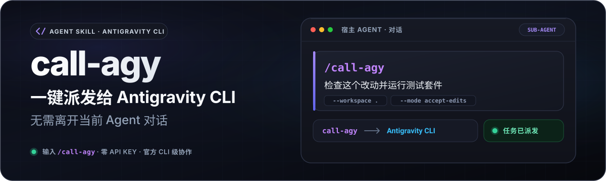
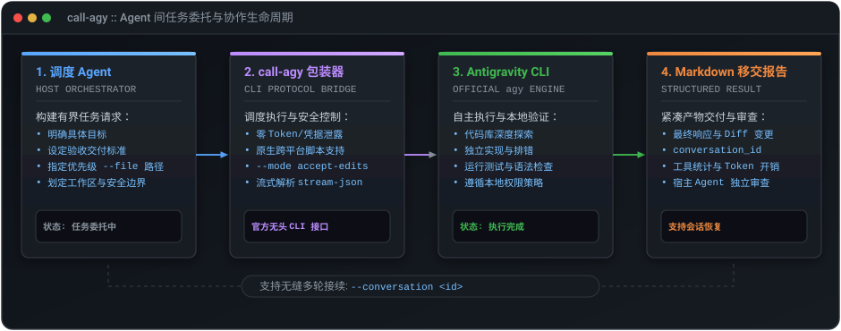

# call-agy

<p align="center">
  <a href="README.md">English</a> | <strong>简体中文</strong>
</p>

<p align="center">
  专为官方 Google Antigravity CLI (<code>agy</code>) 无头模式设计的<strong>宿主无关（Host-Agnostic）AI Agent 任务级委托 Skill</strong>。
</p>

<p align="center">
  
</p>

<p align="center">
  <a href="https://github.com/F1rstDan/call-agy/releases"></a>
  <a href="https://github.com/F1rstDan/call-agy/blob/main/LICENSE"></a>
  <a href="https://github.com/F1rstDan/call-agy/commits/main"></a>
</p>

---

## 核心特性

- **在常用 Agent 中直接体验新模型**：直接在日常使用的 AI Agent 宿主中调用（如 Codex、DeepSeek Harness），将 `agy` 作为专属子 Agent 调度，无需切换工具或工作流即可快速体验与评测 Antigravity 上的前沿模型。
- **零 API Key 极速起步**：开箱即用。只要本地完成过一次官方交互式登录（在终端运行 `agy`），Skill 即可直接调用，全程无需向宿主或 Skill 配置任何 API 密钥或环境变量。
- **基于官方文档的子 Agent 边界**：严格基于官方无头 CLI 接口进行任务级委托，**不是**模型层代理（Shim）；不提取 OAuth 凭据，不暴露未授权的网络代理端点，架构边界清晰透明。
- **结构化 Markdown 移交报告**：实时流式解析官方 `stream-json` 事件并过滤高噪工具输出，生成包含完整组装提示词、最终执行结果、工具调用频次、Token 统计与会话元数据的紧凑交付报告。
- **长提示词直通与多轮会话接续**：60 KiB 内消息通过 `stdin` 直通发送；超长提示词自动安全暂存并与会话交付报告归组。返回确定性 `conversation_id`，支持多轮上下文无损接续。
- **原生全平台与可控安全姿态**：提供零额外依赖的 POSIX Shell (`call_agy.sh`)、Windows PowerShell (`call_agy.ps1`) 与跨平台 Python (`call_agy.py`) 启动脚本；提供受信任工作区快速修改预设与显式安全模式（Safe Mode）。

---

## 工作机制

`call-agy` 实现了严谨的 Agent 间协作闭环：

<p align="center">
  
</p>

1. **宿主编排 (Host Orchestration)**：调度 AI Agent 明确任务目标、模型选择（`--model`）、验收标准与工作区边界，并提供可选的优先级参考文件（`--file`）。
2. **协议桥接 (Protocol Bridge)**：`call_agy.py` 标准化路径参数并调用 `agy --print= --input-format stream-json --output-format stream-json`，通过标准输入流式传递组装提示词。
3. **自主执行 (Autonomous Execution)**：Antigravity 作为子 Agent 在工作区内按指定权限运行。受信任工作区预设会自动批准工具调用；安全模式保留常规权限确认提示。
4. **结构化交付 (Structured Handoff)**：`call-agy` 捕获终端结果与执行指标，过滤冗余日志，生成紧凑的 Markdown 移交报告并保存至系统临时目录。
5. **宿主审查 (Host Verification)**：调度 Agent 读取移交报告并审查工作区实际代码 Diff，验证无误后向用户汇报或继续后续多轮任务。

---

## 环境要求

- **Antigravity CLI**：官方 `agy` 命令行工具（需 **1.1.15+** 以支持结构化 `stream-json` 输入与输出；推荐使用最新版）。
- **本地认证**：只需在终端运行一次官方 `agy` 完成常规登录。**无需配置任何 API 密钥或环境变量**。
- **Python 环境**：Python 3.10+（可通过 `python`、`python3` 或 `py` 调用）。
- **宿主 Agent**：任何能够读取 `SKILL.md` 并执行本地进程的 AI Agent 环境（如 Codex、DeepSeek Harness）。

> 官方 Antigravity 无头模式文档：https://antigravity.google/docs/cli/headless/

---

## 安装与配置

### 方式一：使用 `npx skills` 一键安装（推荐）

```bash
npx skills add F1rstDan/call-agy
```

更新：
```bash
npx skills update call-agy
```

### 方式二：使用 `git clone` 手动安装

```bash
# macOS / Linux
git clone https://github.com/F1rstDan/call-agy.git ~/.agents/skills/call-agy

# Windows (PowerShell)
git clone https://github.com/F1rstDan/call-agy.git "$env:USERPROFILE\.agents\skills\call-agy"
```

更新：
```bash
git -C ~/.agents/skills/call-agy pull
```

---

## 快速上手

### 1. 完成本地认证（仅需一次，零配置）

```bash
agy
```

*在终端运行一次 `agy` 完成登录即可。无需配置 API Key。*

### 2. 执行委托任务

#### macOS / Linux (POSIX Shell)

```bash
./scripts/call_agy.sh "分析当前仓库的核心请求处理流程并进行总结" --workspace .
```

#### Windows (PowerShell)

```powershell
& ".\scripts\call_agy.ps1" --task "分析当前仓库的核心请求处理流程并进行总结" --workspace .
```

*请在当前 PowerShell 进程中直接调用启动脚本；嵌套 `powershell -Command` 会增加不必要的引号解析层级。*

#### 跨平台 (Python 3)

```bash
python3 scripts/call_agy.py "分析当前仓库的核心请求处理流程并进行总结" --workspace .
```

#### 长提示词 / 多行输入 (stdin)

对于复杂任务或长篇规范，推荐通过 `stdin` 管道传入提示词：

```powershell
@'
分析当前仓库。
说明核心请求流程，并根据代码逐项验证结论。
'@ | .\scripts\call_agy.ps1 --workspace .
```

*60 KiB 内的提示词通过内存流直通；超长提示词会自动暂存至 `%TEMP%/call-agy/.big-prompt/`，并在运行结束后与最终移交报告归组。*

### 3. 标准执行输出

任务完成后，`call-agy` 会向标准输出打印紧凑的元数据：

```text
conversation_id=<conversation-id>
output_path=<system-temp>/call-agy/<conversation-id>/<turn-id>-handoff.md
elapsed=14.2s
status=SUCCESS
```

调度 Agent 读取 `output_path` 文件获取结构化报告，并在接纳结果前审查实际的工作区变更。`conversation_id` 为后续恢复多轮会话的唯一标识凭证。

---

## 多轮会话接续

若后续任务依赖上一轮的上下文，可传入返回的 `conversation_id` 进行无缝恢复：

```bash
./scripts/call_agy.sh \
  "基于上面的分析结果，为边界异常场景补充单元测试" \
  --workspace . \
  --conversation "<conversation-id>"
```

> **提示**：虽然 `-c, --continue` 可以恢复工作区最近一次会话，但在多任务并发或严谨编排场景下，强烈建议使用 `--conversation <id>` 确保调度的确定性。

---

## 典型 Agent 提示词示例

**你可以直接这样说:**

在向宿主 Agent 发出指令时（例如体验新模型或委托独立子任务），可采用如下提示词模式：

```text
使用 $call-agy 并指定最新模型（--model <slug>）调查当前仓库中的这个报错。
将失败的测试文件和关键源码作为优先级路径（--file）传入。
让 Antigravity 作为子 Agent 独立实现修复并运行测试验证，随后审查其移交报告和代码 Diff 再向我汇报。
```

---

## CLI 常用参数一览

| 参数 | 说明 |
| :--- | :--- |
| `-w, --workspace <path>` | **Wrapper 专用**：设置进程工作目录，并自动授权原生 `agy` 访问（默认：当前目录）。 |
| `-f, --file <path>` | **Wrapper 专用**：向提示词追加优先级文件路径提示（可重复指定）。 |
| `--add-dir <path>` | 额外向 Antigravity 授予工作区外部目录的访问权限（可重复指定）。 |
| `--conversation <id>` | 恢复指定的 Antigravity 会话 ID。 |
| `-c, --continue` | 恢复工作区内最近一次活跃的 Antigravity 会话。 |
| `--model <slug>` | 显式指定模型 Slug（可从 `agy models` 中获取；默认使用 CLI 全局配置）。 |
| `--effort <low\|medium\|high>` | 设定模型推理思考强度。 |
| `--agent <name>` | 指定内置或自定义 Agent 身份（可从 `agy agents` 中获取）。 |
| `--timeout <duration>` | 运行超时时间，例如 `10m`, `30m`（默认：`10m`）。 |
| `--mode <accept-edits\|plan>` | 执行模式；在明确授权修改代码时请使用 `accept-edits`。 |
| `--sandbox` | 启用 Antigravity 终端沙箱限制。 |
| `--dangerously-skip-permissions` | **原生 `agy` 高危参数**：自动批准全部工具调用。受信任工作区修改预设默认使用。 |
| `-o, --output <path>` | 自定义 Markdown 移交报告保存路径。 |
| `--raw-output <path>` | 调试专用：捕获原始 NDJSON 事件流。 |
| `--agy-binary <path>` | 覆盖 `agy` 可执行文件路径或名称。 |
| `--dry-run` | 仅打印命令结构、序列化提示词大小与选定传输方式，不执行任务。 |

---

## 权限、CLI 边界与安全模型

- **基于官方文档的子 Agent 委托**：`call-agy` 仅通过官方无头模式调用本地 `agy` CLI。它不是模型代理，不提取 OAuth 访问凭据，也不提供外部网络端点。
- **零凭据暴露与安全隔离**：Skill 本身无需也绝不读取、存储任何 API 密钥或 OAuth 凭据，完全依赖官方 CLI 管理的本地用户会话。
- **受信任工作区修改预设**：用户授权在受信任工作区修改代码时，宿主流程首调使用 `--mode accept-edits --sandbox --dangerously-skip-permissions` 自动批准工具调用；`--sandbox` 会约束终端执行，但不能让任意写入变得无害。
- **安全修改覆盖**：用户明确要求安全模式或保守权限时，宿主改用 `--mode accept-edits --sandbox`，保留全部交互式权限检查。
- **显式工作目录指令**：每次委托都会要求 Antigravity 直接在 `--workspace` 绝对路径下工作，并使用原生文件编辑工具写入内容，避免 Windows 下的长内联 shell 命令。
- **外部目录边界隔离**：`--file` 仅作为优先级提示，无法越权访问工作区外的文件；如需访问外部模块，必须显式声明 `--add-dir <path>`。
- **敏感信息脱敏**：标准 Markdown 移交报告默认丢弃工具调用的原始入参和输出日志，避免 Token 膨胀与敏感信息泄露。

---

## 故障排查 (Troubleshooting)

当委托执行失败（非零退出码或非 `SUCCESS` 状态）时，宿主 Agent 应执行以下自愈逻辑：

1. **诊断原因**：读取 stderr 与 Markdown 移交报告中的 Error 诊断区块。
   - `AGY_NOT_FOUND` ➔ 检查 PATH 环境变量，或通过 `--agy-binary <path>` 指定 CLI 绝对路径。
   - `AUTH_REQUIRED` ➔ 在终端运行 `agy` 完成交互式登录，然后重试。
   - `HOST_SANDBOX_BLOCKED` ➔ 请求宿主层开放 `~/.gemini/antigravity-cli` 的文件访问权限。
   - `AGY_VERSION_UNSUPPORTED` ➔ 当前 CLI 不支持所需的无头参数；运行 `agy update` 或升级安装。
   - 未生成 `output_path` ➔ Wrapper 启动前即失败，请先检查 shell 命令语法。
2. **安全恢复**：
   - 外部文件边界 ➔ 使用 `--add-dir <path>` 补充目标所在的外部目录。
   - 安全模式下 shell 权限软拒绝 ➔ 配置细粒度 Antigravity 命令规则，或与用户确认是否调整权限。
   - 超时中断 ➔ 适当增加 `--timeout 20m`。
   - 会话失效 ➔ 移除 `--conversation` 参数重新开启新会话。
3. **单次重试额度**：针对由于偶发性空错误导致的零 Token 失败，Wrapper 会自动重试一次（输出 `attempts=2`）；此时请勿发起第三次重试。

---

## 非设计目标 (Non-Goals)

`call-agy` 专注于**任务级子 Agent 委托**，坚决不做以下行为：

- ❌ 作为模型提供方代理（Shim）或封装 OpenAI 兼容的 API 端点。
- ❌ 提取、保存或复用 Antigravity 的 OAuth 访问凭据或 Token。
- ❌ 绕过 CLI 直接请求 Google/Antigravity 内部后端接口。
- ❌ 将宿主用户的每一轮常规对话无条件转发代理给 Antigravity。
- ❌ 在缺少用户显式授权时擅自变更 Antigravity 的本地权限与沙箱策略。

---

## 开源协议

本项目采用 MIT 许可证开源。详情请参阅 [LICENSE](LICENSE) 与 [NOTICE](NOTICE)。

