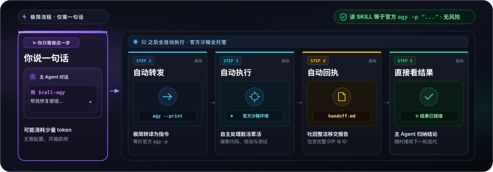

# call-agy

<p align="center">
  <a href="README.md">English</a> | <strong>简体中文</strong>
</p>

<p align="center">
  专为官方 Google Antigravity CLI (<code>agy</code>) 设计的<strong>宿主无关（Host-Agnostic）AI Agent 任务级委托 Skill</strong>。
</p>

<p align="center">
  
</p>

<p align="center">
  <a href="https://github.com/F1rstDan/call-agy/releases"></a>
  <a href="https://github.com/F1rstDan/call-agy/blob/main/LICENSE"></a>
  <a href="https://github.com/F1rstDan/call-agy/commits/main"></a>
</p>

---

## 核心特性

- 无需切换现有工作流，在日常使用的 AI 编程环境（如 Codex、DeepSeek Harness 等）中直接把 `agy` 作为专属子 Agent 调用，快速体验并评测最新大模型（Gemini 3.7 Flash, Gemini 3.1 Pro, Claude Opus 4.6）。
- **零 API Key 极速起步**：本地仅需运行一次官方 `agy` 登录，无需在宿主或 Skill 中配置、管理任何 API 密钥或环境变量。
- **复杂任务一键外包与结构化交付**：将耗时的代码分析、Bug 调查、单测编写等任务直接委托给子 Agent，自动获取清晰的 Markdown 交付报告与改动 Diff。
- **安全透明的官方子 Agent 边界**：严格基于官方无头 CLI 接口委托，不提取敏感凭据，不暴露外部代理网络端口，权限与沙箱边界清晰可控。

<p align="center">
  
</p>

*只需一句话，主 Agent 即可将任务委托给官方无头 `agy` 并在原生沙箱中自主执行，返回整洁的 Markdown 移交报告。*

---

## 快速上手

### 1. 前提准备（仅需 3 步）

1. **安装 Antigravity CLI**：确保本地已安装官方 `agy` 命令行工具。
2. **终端登录（仅需一次）**：在终端运行一次 `agy` 完成官方交互式登录（无需配置任何 API Key）。
3. **安装本 Skill**：
   ```bash
   npx skills add F1rstDan/call-agy
   ```

### 2. 在 Agent 中直接使用

安装完成后，你可以直接在宿主 Agent 对话框中用自然语言派发任务。

**你可以直接这样说：**

> **场景 1：深度架构与流程分析**
> ```text
> 使用 $call-agy 分析当前仓库的核心请求处理流程并总结架构要点。
> ```
> *子 Agent 会在只读模式下分析代码库，并返回结构化分析报告。*

> **场景 2：定位排错与修复验证**
> ```text
> 使用 $call-agy 调查并修复这个报错，把 tests/test_api.py 和关键源码作为优先级文件传入，修复后运行测试验证。
> ```
> *Antigravity 作为子 Agent 独立定位问题、应用修改并运行测试，完成后返回交付报告和代码 Diff。*

> **场景 3：代码审查与优化建议**
> ```text
> 让 Antigravity 审查这段代码，重点排查并发安全与边界条件，并给出优化建议。
> ```
> *借助前沿模型的推理能力对关键模块进行深度审查。*

> **场景 4：多轮上下文接续补全测试**
> ```text
> 基于刚才的分析结果，使用 $call-agy 为边界异常场景补充完整的单元测试。
> ```
> *自动关联上一轮会话上下文，实现多轮无损接续。*

---

## 安装与配置

### 方式一：使用 `npx skills` 一键安装（推荐）

```bash
npx skills add F1rstDan/call-agy
```

更新：
```bash
npx skills update call-agy
```

### 方式二：使用 `git clone` 手动安装

<details>
<summary>点击展开 Git 安装方式</summary>

```bash
# macOS / Linux
git clone https://github.com/F1rstDan/call-agy.git ~/.agents/skills/call-agy

# Windows (PowerShell)
git clone https://github.com/F1rstDan/call-agy.git "$env:USERPROFILE\.agents\skills\call-agy"
```

更新：
```bash
git -C ~/.agents/skills/call-agy pull
```

</details>

---

## 环境要求

- **Antigravity CLI**：官方 `agy` 命令行（1.1.15+，推荐最新版）
- **本地认证**：终端运行一次 `agy` 登录（无需 API Key）
- **Python 环境**：Python 3.10+
- **宿主 Agent**：支持 Skill 机制的 AI Agent（如 Codex、DeepSeek Harness 等）

---

## 深入了解与技术参考

<p align="center">
  
</p>

想了解底层执行机制、流程架构、CLI 完整参数、安全模型或故障排查？请参阅：

👉 **[工作原理与技术参考 (how_work.md)](how_work.md)**

---

## 开源协议

本项目采用 MIT 许可证开源。详情请参阅 [LICENSE](LICENSE) 与 [NOTICE](NOTICE)。
